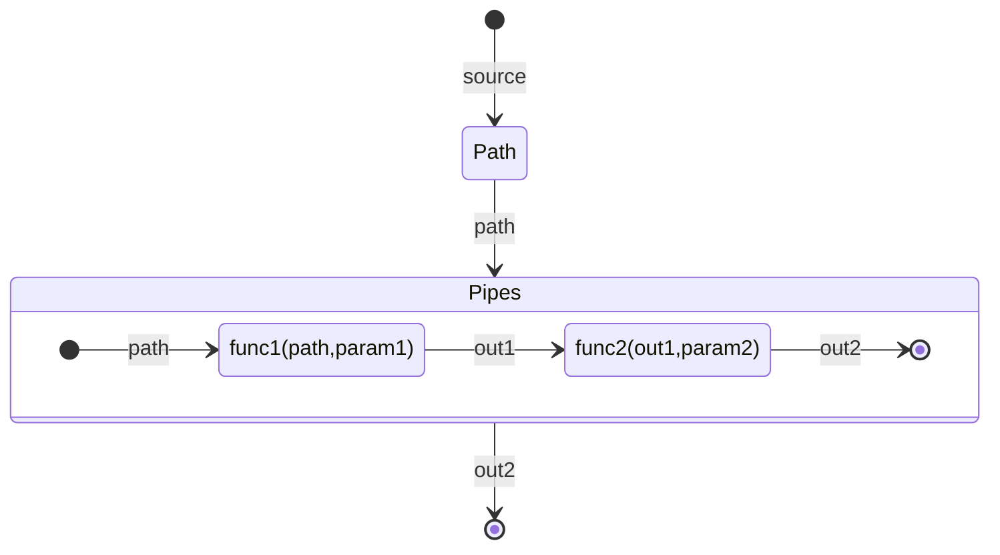

# Pipe Functions

### What Is A Pipe Function?

A pipe function is a function that is chained in the format expression. Pipe functions are executed sequentially.

```typescript
"${path:func1(param1)|func2(param2)}"
```



For the expression above, the execution order;

* evaluates the `path`
* executes `func1()` with the evaluated value
* executes `func2()` with the result of the `func1()`
* returns the output of `func2()`

### Naming Convention

A transformation's name must be a valid javascript function name. For clarity, the camel case naming convention is suggested.

### Parameters

A transformation function only accepts valid JSON values.

* `number`
* `string`
* `boolean`
* `null`
* `JSON object`
* `array`
